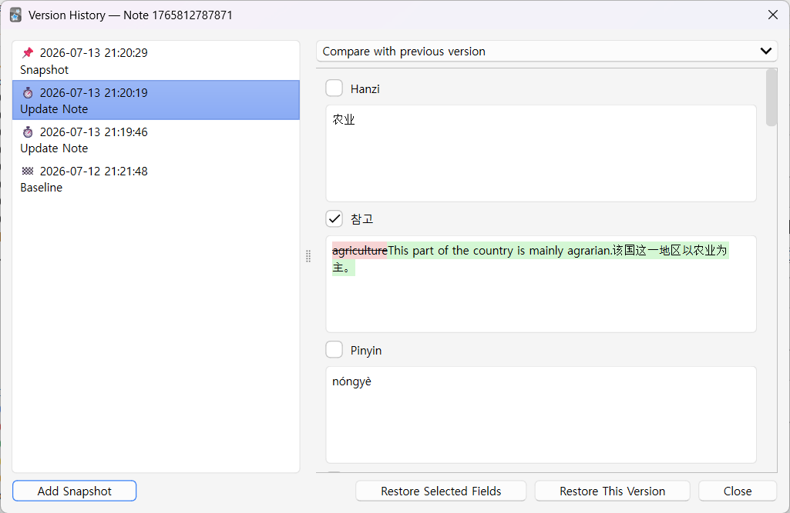
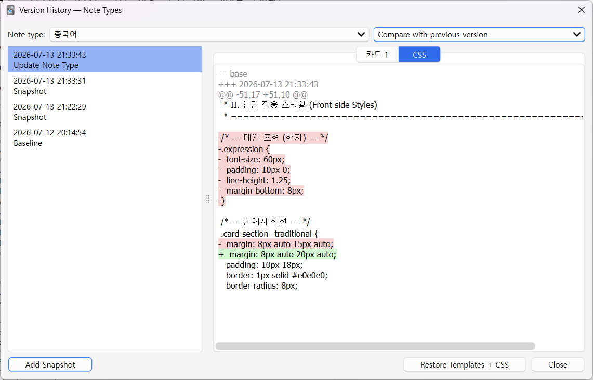
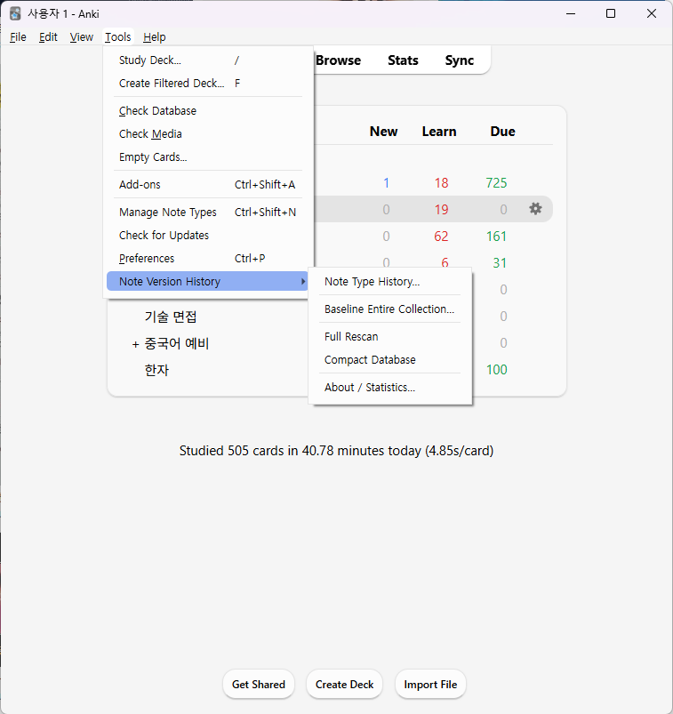

# Anki 버전 기록 — 노트·노트타입

*다른 언어로 보기: [English](README.md)*

Anki 안에서 동작하는 git식(append-only) 버전 기록 애드온입니다. **노트**(필드·태그)와
**노트타입**(카드 템플릿 + CSS)의 모든 변경을 기록하고, 타임라인에서 필드별 diff로
확인하며 원하는 버전으로 복원할 수 있습니다.

> 기록은 프로필별로 애드온의 `user_files/`에 **로컬 저장**되며 `collection.anki2`에는
> **절대 쓰지 않습니다.** 기기 간 동기화되지 않습니다.

## 스크린샷

| 노트 기록 & 필드별 diff | 노트타입(템플릿/CSS) diff | 도구 메뉴 |
| :---: | :---: | :---: |
|  |  |  |

## 기능

- **자동 캡처** — 편집할 때 Anki의 undo 시스템에 얹혀 자동 기록(undo/redo도 reflog처럼
  기록).
- **기본은 지연(lazy)** — 설치 시 강제 베이스라인 없음. 노트를 편집기에서 열 때 "편집 전"
  상태를 캐시해 두고, 실제로 바꾸는 순간 그것을 베이스라인으로 기록합니다. 원하면 전체
  컬렉션을 도구 메뉴에서 한 번에 베이스라인할 수도 있습니다.
- **필드별 diff·복원** — 전체 버전 또는 선택한 필드만 복원. 복원 자체도 Ctrl+Z로 되돌릴
  수 있고 기록됩니다(append-only).
- **노트타입** — 카드 템플릿·CSS의 색상 diff. 필드 스키마는 건드리지 않고 템플릿+CSS만
  복원(전체 동기화 강제 없음).
- **보존·유지보수** — 설정 가능한 정리(pruning)와 공간 회수용 압축 명령.
- **영어 / 한국어** UI (Anki 언어를 따름).

> **예정:** 미디어 파일 버전 기록은 구현돼 있으나 이번 릴리스에선 비활성화 상태입니다.
> 향후 업데이트에서 활성화될 예정입니다.

## 요구 사항

- Anki **23.10 이상** (Qt6). Anki 26.5에서 개발·테스트.

## 설치

- **AnkiWeb**(권장): 설치 코드 **`1237174160`** — Anki에서 도구 → 부가기능 → 부가기능
  받기 → 코드 붙여넣기.
- **수동**: [Releases](https://github.com/udonehn/anki-version-history/releases)에서
  `.ankiaddon`을 받아 더블클릭(또는 Anki로 드래그).

## 사용법

- **노트 기록** — 탐색창에서 카드 우클릭 → **🕘 버전 기록**, 또는 **Ctrl+Alt+H**, 또는
  편집기 툴바의 **🕘** 버튼.
- **노트타입 기록** — 도구 → *노트 버전 기록* → **노트타입 기록…**, 또는 카드 유형 편집기
  안의 **🕘** 버튼.
- **전체 베이스라인**(선택, 완전 커버리지) — 도구 → *노트 버전 기록* → **전체 컬렉션
  베이스라인 만들기…**.
- 각 창의 비교 모드: *이 버전 내용만 보기*, *현재와 비교*, *이전 버전과 비교*.

## 작동 방식

Anki에는 "편집 직전" 훅이 없어서, 노트가 편집기에 로드될 때 상태를 캐시해 두고 그 노트가
처음 바뀌는 순간 그것을 베이스라인으로 기록합니다. 모든 데이터는 애드온 `user_files/`
아래 프로필별 SQLite DB에 있으며, 컬렉션은 읽기만 하고 복원은 전부 Anki 공개 undo 가능
API를 통합니다.

## 개발

```bash
python -m venv .venv
# Windows
.venv/Scripts/python -m pip install anki pytest pytest-cov ruff
.venv/Scripts/python -m pytest                      # headless 테스트 (실제 anki pylib)
.venv/Scripts/python -m ruff check src tests build.py
.venv/Scripts/python build.py                       # -> dist/*.ankiaddon
```

라이브 테스트용으로 패키지를 Anki에 연결(Windows, Anki 실행 사용자와 동일 계정):

```
cmd /c mklink /J "%APPDATA%\Anki2\addons21\note_version_history" "<repo>\src\note_version_history"
```

`aqt`를 import하는 곳은 `__init__.py`, `scheduler.py`, `ui/`뿐이고 나머지는 전부
headless로 단위 테스트됩니다.

## 라이선스

[AGPL-3.0](LICENSE) © 2026 udonehn. Anki의 `anki`/`aqt`가 AGPL-3.0이고 이 애드온은 이를
링크합니다.
