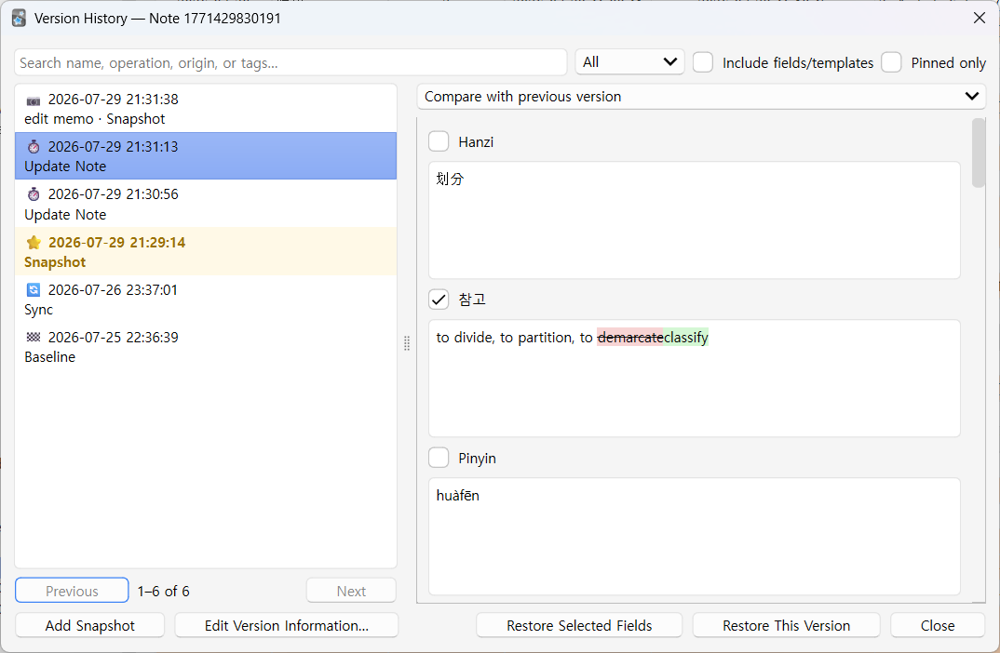
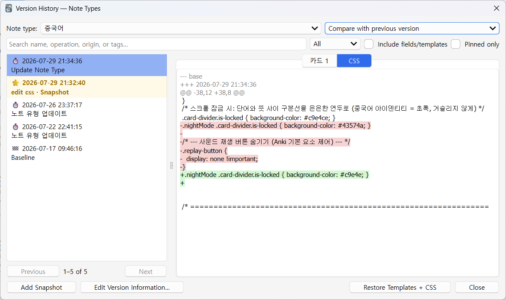
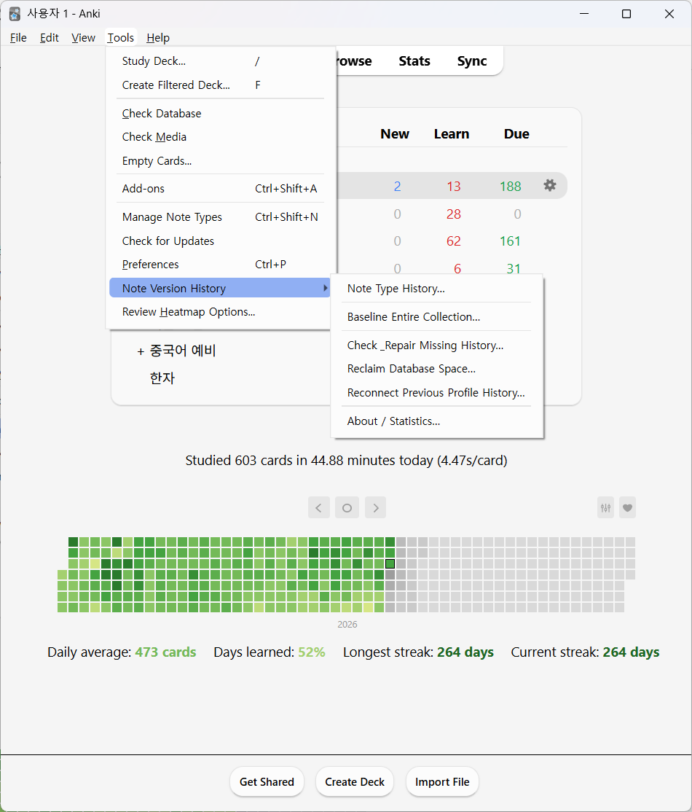

# Anki 버전 기록 — 노트·노트타입

*다른 언어로 보기: [English](README.md)*

Version History는 Anki **노트**(필드·태그)와 **노트타입**(카드 템플릿·CSS)에서
관찰된 변경 상태를 로컬 타임라인에 보관합니다. Anki 안에서 필드별 차이를 확인하고,
이름 있는 스냅샷을 만들고, 호환되는 내용을 복원할 수 있습니다.

이 애드온은 모든 중간 키 입력을 보증하는 감사 로그가 아니라 안전망입니다. 자동 캡처에는
기본 1.5초 debounce가 적용되므로 빠르게 연속된 작업은 하나의 저장 상태로 합쳐질 수
있습니다. 고정하지 않은 오래된 자동 노트 버전은 보존 설정에 따라 정리됩니다.

> 기록은 Anki 프로필별로 애드온의 `user_files/` 아래에 로컬 저장됩니다.
> `collection.anki2`에 기록되거나 AnkiWeb으로 동기화되지 않으며, 기기끼리 공유되지
> 않습니다. 동기화로 들어온 상태를 캡처할 수는 있지만, 한 번도 캡처되지 않은 동기화 전
> 상태를 나중에 재구성할 수는 없습니다. 이전 상태가 중요하면 동기화 전에 전체
> 베이스라인을 만드세요.

## 스크린샷

| 노트 기록 & 필드별 diff | 노트타입(템플릿/CSS) diff | 도구 메뉴 |
| :---: | :---: | :---: |
|  |  |  |

## 기능과 캡처 범위

- **자동 캡처** — Anki 작업 뒤에 관찰 가능한 노트·노트타입 변경을 검사합니다.
  실행 취소와 다시 실행도 재검사합니다. 기본 1,500ms debounce 때문에 빠른 여러 작업이
  작업별 행이 아니라 하나의 버전으로 저장될 수 있습니다.
- **동기화 인식 캡처** — 일반 병합 동기화로 바뀐 노트를 재검사해 *동기화*로 표시합니다.
  전체 동기화로 컬렉션이 교체된 뒤에는 전체 베이스라인이 있을 때만 모든 노트를
  재검사합니다. 지연 모드에서는 의도적으로 이미 추적 중인 노트만 재검사하며, 동기화가
  끝난 뒤 미추적 노트의 이전 상태를 재구성할 수 없습니다.
- **지연 시작, 선택 가능한 전체 커버리지** — 설치만으로 기존 노트 전체를 복사하지
  않습니다. 편집기에 노트가 로드되면 편집 전 상태를 캐시해 첫 베이스라인으로 쓸 수
  있습니다. 이는 일괄 작업, 다른 애드온, 동기화가 바꾼 미추적 노트를 보호하지 못합니다.
  그런 작업 전의 상태가 필요하면 먼저 전체 베이스라인을 만드세요.
- **차이·검색·비교** — 필드와 태그 또는 템플릿과 CSS를 확인하고, 100행 단위 페이지를
  검색·필터하며, 서로 다른 페이지의 버전을 포함해 두 저장 버전을 A→B로 비교합니다.
- **스냅샷과 고정** — 하나 또는 여러 선택 노트의 이름 있는 스냅샷을 만들고 중요한
  버전을 고정합니다. 고정한 자동 버전은 정리에서 보호됩니다. 수동 스냅샷은 고정을
  풀어도 정리되지 않습니다.
- **실행 취소 가능한 복원** — Anki 공개 undo 가능 API로 복원하며, 복원 결과도 새로운
  복원 행으로 기록합니다. 정확한 복원 범위는 아래에 설명합니다.
- **프로필 인식 로컬 저장소** — 프로필 이름을 바꿔도 기록 연결이 유지됩니다.
  **이전 프로필 기록 다시 연결…**은 디렉터리를 병합하거나 삭제하지 않고 고아가 된 기록
  DB를 현재 프로필에 연결합니다.
- **유지보수 도구** — 전체 베이스라인이 있는 컬렉션의 기록 누락을 검사하고, 통계와 DB
  위치를 확인하고, SQLite의 빈 공간을 회수합니다.
- **영어 / 한국어 UI** — 기본값은 Anki 언어를 따르며 애드온 설정에서 바꿀 수 있습니다.

미디어 파일 기록 코드는 소스에 있지만 이번 릴리스에서는 비활성화되어 있습니다.
미디어 관련 설정 키는 현재 아무 효과가 없습니다.

## 요구 사항

- Anki **23.10 이상**(Qt6)
- Anki **26.05**에서 개발·테스트

## 설치

### 새로 설치

1. Anki에서 **도구 → 부가기능 → 부가기능 받기…**를 엽니다.
2. **`1237174160`**을 입력합니다
   ([AnkiWeb 페이지](https://ankiweb.net/shared/info/1237174160)).
3. 설치가 끝나면 Anki를 재시작합니다.
4. 아직 열거나 편집하지 않은 노트까지 보호하려면 시작 후 제안되는 전체 베이스라인을
   만드세요.

### Windows에서 1.2.0 이하 버전으로부터 업데이트

1.2.0까지는 Anki가 업데이트를 위해 `user_files/`를 보존하려는 동안 `history.db`를
열어 둔 채로 둘 수 있었습니다. 그 결과 Windows에서 `user_files`를
`addons21/files_backup`으로 이름 바꿀 때 `PermissionError: [WinError 5]`가
발생했습니다. 1.2.1은 이후 설치·업데이트 전에 런타임을 닫지만, 최초 업데이트 전에는
구버전이 이 새 코드를 실행할 수 없습니다.

최초 한 번은 다음 절차를 따르세요.

1. Anki를 완전히 종료합니다.
2. **Shift**를 누른 채 Anki를 실행하고, 이번 실행에서 애드온이 비활성화된 상태로 Anki가
   열릴 때까지 Shift를 누릅니다.
3. **도구 → 부가기능**을 열고 **업데이트 확인**을 실행합니다.
4. 1.2.1 이상을 설치하고 Anki를 종료한 다음 평소처럼 다시 실행합니다.

Anki 공식 [애드온 문제 해결 및 안전모드
안내](https://docs.ankiweb.net/troubleshooting.html#check-add-ons)도 참고하세요. 이전
기록이 필요 없다면 구버전을 삭제한 뒤 다시 설치해도 됩니다. 보관할 데이터가 있다면
같은 Shift 안전모드 실행에서 구버전을 삭제하고, 평소처럼 재시작한 뒤 설치 코드
`1237174160`으로 다시 설치하세요. 보관할 데이터가 있다면 삭제 전에 아래 **로컬 데이터와
백업**을 먼저 확인하세요.

## 최초 설정: 베이스라인 만들기

기본 지연 모드는 컬렉션 전체를 복사하지 않고 새로 관찰된 상태부터 기록합니다. 프로필을
처음 열 때 전체 베이스라인을 한 번 제안합니다. 거절하면 자동 제안은 다시 뜨지 않지만
다음 명령은 계속 사용할 수 있습니다.

**도구 → 노트 버전 기록 → 전체 컬렉션 베이스라인 만들기…**

일괄 찾아 바꾸기, 대규모 가져오기, 전체 동기화, 많은 노트를 바꾸는 다른 애드온을
사용하기 전에 전체 베이스라인을 만드는 것을 강력히 권장합니다. 전체 베이스라인은
**기록 누락 검사·복구…**를 사용하기 위한 조건이며, 한 번도 추적되지 않은 노트의 변경 전
상태를 저장해 두는 유일한 방법입니다. 베이스라인은 백그라운드에서 컬렉션을 읽으며,
중단되면 이어서 실행할 수 있습니다.

## 사용법

### 노트

- 탐색창에서 카드 하나를 선택하고 **노트 → 🕘 버전 기록…**, 우클릭 명령 또는
  **Ctrl+Alt+H**를 사용합니다. 편집기에도 **🕘** 버튼이 있습니다.
- 탐색창 우클릭 메뉴의 **선택한 노트 스냅샷**으로 하나 또는 여러 선택 노트를 나누어
  백그라운드 저장할 수 있습니다.
- 이름·작업명·출처·태그를 검색하고 필요하면 필드 내용도 포함합니다.
  자동·동기화·스냅샷·복원·베이스라인·삭제·고정 필터를 제공합니다.
- **지정한 두 버전 비교 (A→B)**에서 페이지와 필터를 넘나들며 비교 끝점을 지정·교환·
  초기화할 수 있습니다.

### 노트타입

- **도구 → 노트 버전 기록 → 노트타입 기록…**을 열거나 카드 템플릿 편집기의
  **🕘 버전 기록…** 버튼을 사용합니다.
- 앞면 템플릿, 뒷면 템플릿, CSS를 확인·비교하고 스냅샷을 만들거나 아래에 설명한 호환
  템플릿/CSS 범위를 복원합니다.

### 도구 메뉴

- **전체 컬렉션 베이스라인 만들기…** — 노트와 노트타입의 1회 전체 베이스라인을 만들거나
  중단된 작업을 이어서 실행합니다.
- **기록 누락 검사·복구…** — 완료된 전체 베이스라인이 있을 때 모든 노트를 해시 검사하고
  기록에 없는 상태를 캡처합니다. 지연 모드에서는 기존 노트 전체를 잘못된 자동 버전으로
  만들지 않도록 실행을 거부합니다.
- **DB 여유 공간 회수…** — SQLite 전체 vacuum으로 이미 비어 있는 페이지를 파일 시스템에
  돌려줍니다. 추가로 삭제할 버전을 선택하는 명령은 아닙니다.
- **이전 프로필 기록 다시 연결…** — 이 애드온의 `user_files/` 아래에서 찾은 다른 기록
  DB를 현재 프로필에 연결합니다. DB를 병합하거나 삭제하지 않습니다.
- **정보 / 통계…** — 노트·노트타입 기록 행 수와 현재 로컬 DB 디렉터리를 보여 줍니다.

## 복원 범위

| 대상 | 복원하는 것 | 복원하지 않는 것 / 조건 |
| --- | --- | --- |
| 존재하는 노트, 전체 버전 | 저장된 필드 중 **현재도 같은 이름이 존재하는 필드**의 값과 태그 | 과거 노트타입, 덱 배정, 카드 상태, 스케줄, 복습 기록을 기록으로부터 재구성하지 않습니다. 현재 이름과 맞지 않는 저장 필드는 건너뜁니다. |
| 존재하는 노트, 선택 필드 | 선택한 저장 필드 중 현재도 같은 이름이 존재하는 필드 | 태그와 선택하지 않았거나 이름이 맞지 않는 필드는 그대로 둡니다. |
| 삭제된 노트, 새 노트로 복원 | 사용자가 고른 덱의 새 노트에 이름이 맞는 필드 값과 태그 | 해당 노트 타임라인이 이미 열려 있거나 다른 방법으로 접근 가능한 동안에만 명령을 사용할 수 있습니다. 현재 삭제 노트 전체를 찾는 전역 목록은 없습니다. 원래 노트 ID, 카드, 스케줄, 복습 기록은 되살리지 않으며 저장 당시 노트타입이 현재도 존재해야 합니다. |
| 존재하는 노트타입 | **템플릿 이름이 정확히 같은** 항목의 앞·뒤 HTML과 CSS | 템플릿 추가·삭제·이름 변경·순서 변경, 필드/스키마, 정렬 필드, 노트타입 이름, 스케줄은 바꾸지 않습니다. 이름이 맞지 않는 항목은 알리고 건너뛰거나 유지합니다. 이 제한된 복원은 전체 동기화를 강제하지 않습니다. |
| 삭제된 노트타입 | 이전 템플릿/CSS 버전은 계속 열람 가능 | 해당 노트타입이 컬렉션에 현재도 존재하지 않으면 복원할 수 없습니다. |

복원은 **Ctrl+Z**로 실행 취소할 수 있습니다. 복원 결과도 새 기록 행으로 저장되어
타임라인에 남습니다. 해당 카드 템플릿 편집기가 이미 열려 있으면 노트타입 복원 내용을
편집기에 불러오며, **저장**을 눌러야 적용됩니다.

*삭제* 필터는 현재 열어 둔 노트 타임라인 안에서만 동작하며, 컬렉션 전체의 삭제 노트
목록이 아닙니다.

## 환경설정

**도구 → 부가기능**을 열고 **Version History - Notes and Note Types**를 선택한 뒤
**설정**을 누릅니다. 도움말 영역에 모든 키가 설명되어 있으며 기본값은 다음과 같습니다.

- 자동 캡처: 켬
- debounce: 1,500ms
- heartbeat 검사: 5분마다
- 보존: 논리 노트별 고정하지 않은 자동 노트 버전 최대 100개 및 180일
- 제외 노트타입 ID: 없음
- 언어: `auto`(Anki 언어를 따름, `en`·`ko` 지정 가능)

설정을 저장하면 설정 캐시와 heartbeat는 즉시 갱신됩니다. `auto_capture`, debounce,
제외 목록은 이후 작업부터 적용됩니다. 보존 설정은 설정창을 닫자마자 실행되는 것이 아니라
다음 자동 유지보수 시점(최대 하루에 한 번)에 적용됩니다. 언어 변경은 새로 생성되는 UI에
반영됩니다. 이미 만들어진 도구 메뉴까지 확실히 다시 표시하려면 Anki를 재시작하세요.

`auto_capture`를 끄면 작업·동기화·heartbeat 캡처, 프로필 시작 후 따라잡기와 비정상 종료
복구, 자동 보존 유지보수가 일시 중지됩니다. 수동 스냅샷, 수동 전체 베이스라인,
**기록 누락 검사·복구…**, 기록 열람, 복원은 계속 사용할 수 있습니다.
꺼진 동안에는 기록 검사 marker/boundary를 버리거나 전진시키지 않으므로, 다시 켠 뒤 첫
자동 검사에서 off 기간에 도달한 최종 관찰 상태가 새 행으로 기록될 수 있지만 그 기간의
변경 전 상태나 중간 상태는 재구성할 수 없습니다.

제외 목록은 자동 **노트** 캡처에만 적용됩니다. 기존 기록을 지우지 않으며, 노트타입 자체,
수동 스냅샷, 수동 전체 베이스라인을 제외하지 않습니다. 자동 노트 보존은 노트타입 버전,
수동 스냅샷, 베이스라인, 복원 행, 삭제 표시, 고정 자동 버전, 노트별 최신 자동 행을
정리하지 않습니다. 정확한 키·범위·적용 시점은
[환경설정 참고 문서](src/note_version_history/config.md)를 확인하세요.

## 로컬 데이터와 백업

기록은 `user_files/`의 프로필별 하위 디렉터리에 있는 스키마 v2 SQLite DB입니다.
노트는 Anki GUID로 추적하며, 프로필 설정 키가 프로필 이름 변경 뒤에도 같은 DB를
연결합니다. 기록 DB는 컬렉션과 분리되어 있습니다. 복원 작업만 Anki API를 통해 의도적으로
컬렉션을 변경합니다.

- **동기화되지 않음:** 기록은 AnkiWeb에 업로드되지 않으며 기기마다 별도 타임라인을
  가집니다.
- **컬렉션 백업에 포함되지 않음:** 이 데이터는 `collection.anki2` 밖에 있으므로 중요하면
  `user_files/`를 별도로 백업하세요.
- **업데이트:** Anki는 애드온 업데이트 시 `user_files/`를 보존하도록 설계되어 있습니다
  ([공식 `user_files` 문서](https://addon-docs.ankiweb.net/addon-config.html#user-files)).
  1.2.1부터는 업데이트 전에 이 애드온의 Windows 파일 핸들도 해제합니다.
- **삭제:** Anki를 닫고 애드온을 삭제하기 전에 `user_files/` 전체를 안전한 곳에
  복사하세요. Anki 26.05는 보통 삭제한 애드온 디렉터리를 운영체제 휴지통으로 보내지만,
  휴지통을 유일한 백업으로 간주하면 안 됩니다.

Windows 기본 위치:

- AnkiWeb/prod: `%APPDATA%\Anki2\addons21\1237174160\user_files`
- 아래 방식으로 연결한 dev: 연결된 소스 트리 안의
  `src\note_version_history\user_files`

따라서 같은 Anki 데이터 폴더를 써도 prod와 dev의 설정 및 기록 DB는 서로 분리됩니다.
하지만 같은 데이터 폴더를 공유하면 두 애드온은 같은 Anki 컬렉션을 대상으로 동작합니다.

## 개발

### 테스트와 패키지 빌드

```powershell
python -m venv .venv
.\.venv\Scripts\python.exe -m pip install -e ".[dev]"
.\.venv\Scripts\python.exe -m pytest
.\.venv\Scripts\python.exe -m ruff check src tests build.py
.\.venv\Scripts\python.exe build.py                 # -> dist/*.ankiaddon
```

`aqt`를 import하는 곳은 `__init__.py`, `scheduler.py`, `ui/`뿐이며 나머지 모듈은
headless 테스트가 가능합니다.

### 하나의 Anki 데이터 폴더에서 일상적인 dev/prod 전환(Windows)

Anki는 로컬 애드온에 숫자가 아닌 폴더 이름을 허용하고, AnkiWeb 애드온에는 숫자 ID를
사용합니다. 따라서 prod 폴더 `1237174160`과 dev junction
`note_version_history_dev`를 함께 둘 수 있습니다. Anki를 닫고 junction을 **최초 한
번만** 만드세요. junction을 삭제하거나 소스 경로를 옮기기 전까지 계속 유효합니다.
두 복사본을 동시에 활성화하면 안 됩니다.

저장소 위치가 다르면 소스 경로를 바꾸고, 다음 명령을 **명령 프롬프트(`cmd.exe`)**에서
실행하세요.

```bat
mklink /J "%APPDATA%\Anki2\addons21\note_version_history_dev" "C:\work\anki-version-history\src\note_version_history"
```

또는 **PowerShell**에서 다음과 같이 실행합니다.

```powershell
cmd /c mklink /J "$env:APPDATA\Anki2\addons21\note_version_history_dev" "C:\work\anki-version-history\src\note_version_history"
```

`addons21` 디렉터리가 이미 있어야 합니다. Anki를 한 번 실행하면 일반 데이터 폴더 구조가
생성됩니다. Anki 공식 [애드온 폴더 및 심볼릭 링크
안내](https://addon-docs.ankiweb.net/addon-folders.html)도 참고하세요.

버전을 전환하는 방법:

1. **도구 → 부가기능**을 엽니다.
2. 현재 활성 복사본을 비활성화하고 원하는 복사본을 활성화합니다. prod가 아직 없다면
   dev를 먼저 비활성화한 뒤 설치 코드 `1237174160`으로 설치합니다.
3. `1237174160`(prod)과 `note_version_history_dev`(dev) 중 정확히 하나만 활성화됐는지
   확인합니다. 표시 이름이 같으면 **파일 보기**로 폴더를 구분합니다.
4. 애드온을 사용하기 전에 Anki를 재시작합니다. 애드온은 시작할 때 로드되므로 활성화 변경은
   재시작 뒤에 반영됩니다.

junction을 숫자 prod 폴더에 연결하거나, junction 위에 `.ankiaddon`을 설치하거나,
Anki 패키지 설치 기능으로 연결된 dev 복사본을 업데이트하거나, Anki의 **삭제** 명령으로
소스 트리를 관리하지 마세요. dev 연결을 없애려면 Anki를 종료한 뒤 소스 디렉터리가 아니라
junction 자체만 제거하세요.

### 위험한 수명주기 테스트용 격리 데이터 폴더

같은 데이터 폴더에서 전환하는 방식은 일상 개발에 편리하지만 실제 프로필과 컬렉션을
공유합니다. 패키지 설치·업데이트·삭제, 마이그레이션, 전체 동기화, 베이스라인/복구,
파괴적인 복원 테스트에는 폐기 가능한 별도 데이터 폴더를 사용하세요. Anki의 `-b`는
[고급 시작 옵션](https://docs.ankiweb.net/files.html#startup-options)이며, 일상적인 소스
편집에 필수인 방법은 아닙니다.

다른 Anki 인스턴스를 모두 종료한 상태에서 격리 데이터 폴더로 Anki를 실행합니다.

```bat
"%LOCALAPPDATA%\Programs\Anki\anki.exe" -b "%LOCALAPPDATA%\AnkiVersionHistoryDev"
```

그 데이터 폴더는 항상 같은 `-b` 인자로 실행하세요. Anki 설치 방식에 따라 실행 파일
경로가 다를 수 있습니다. `.ankiaddon`을 빌드한 뒤 이 격리 데이터 폴더의 로컬 패키지
설치 기능으로 설치하세요. 일상 개발용 소스 junction을 여기에 추가하면 **안 됩니다.**
Anki 데이터 폴더가 달라도 같은 소스 트리를 가리키는 두 junction은 소스 트리 안의
`user_files/`를 공유합니다. 실제로 설치한 패키지는 폐기 가능한 데이터 폴더 안에 독립된
`user_files/`를 가지며 Anki의 실제 설치·업데이트·삭제 수명주기를 검증합니다.

격리 데이터 폴더에서도 라이브 소스 연결이 꼭 필요하다면, 일상 작업 트리의
`user_files/`를 공유하지 않도록 별도의 폐기 가능한 checkout 또는 소스 복사본을 junction
대상으로 사용하세요.

## 라이선스

[AGPL-3.0](LICENSE) © 2026 udonehn. Anki의 `anki`/`aqt` 패키지가 AGPL-3.0이고 이
애드온은 이에 링크합니다.
